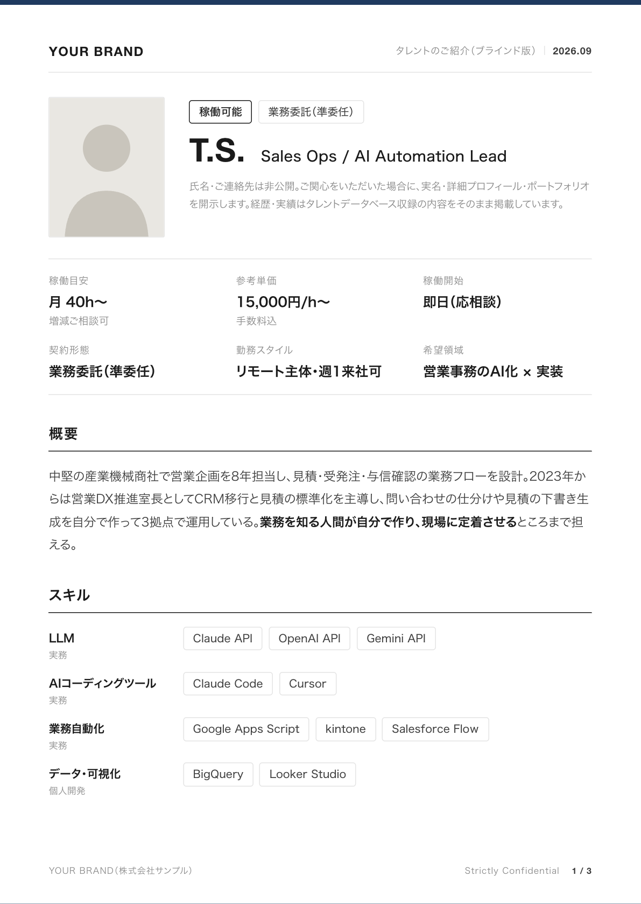
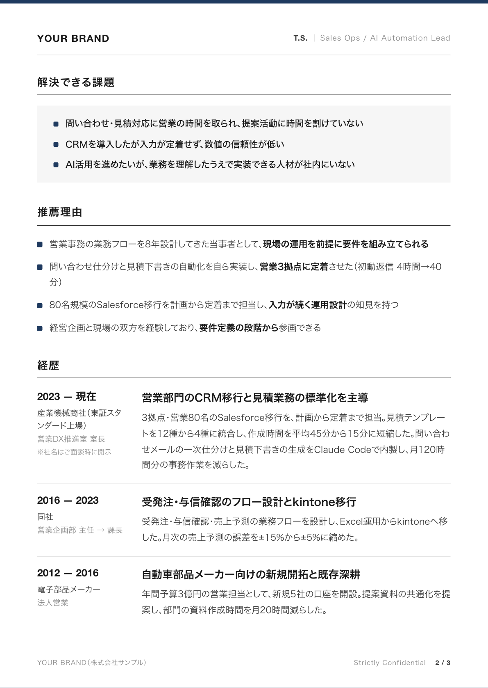
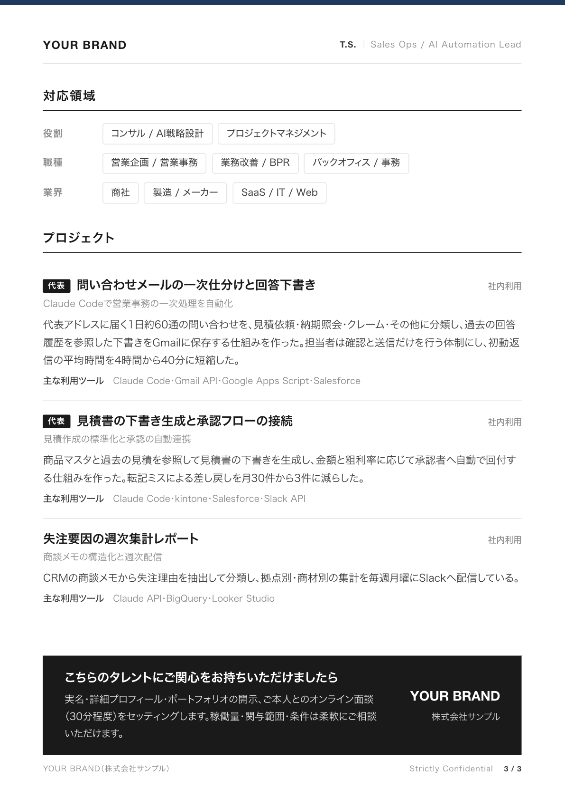

# [Prime共有用] タレントプロフィール作成

タレント1名のブラインドプロフィール（A4縦・2〜3ページのPDF）を、自社の名義で出すためのキットです。
`brand/brand.json` にロゴとキーカラーを入れると、以降に作るプロフィールはすべてその体裁になります。
中身のデータは `talents/<slug>/talent.json` に書きます。手で書いても、Claude Code に書かせてもかまいません。

| 1ページ目 | 2ページ目 | 3ページ目 |
|---|---|---|
|  |  |  |

上の画像は架空のサンプル（`talents/_example`）を、いまの `brand/brand.json` で描いたものです。
ブランド設定を変えて push すると、数分後にこの画像が自社の色とロゴに置き換わります。

## はじめかた

### 1. 自社のリポジトリを作る

GitHub でこのリポジトリの「Use this template」から自社の組織に複製します（Private のままで）。
手元に clone して依存を入れます。Node.js 22.12 以上が必要です。

```bash
git clone <自社リポジトリのURL>
cd <リポジトリ名>
npm install
```

`npm install` の途中で PDF 描画用の Chrome（約170MB）をダウンロードします。

### 2. ロゴと色を設定する

```bash
npm run setup
```

ブランド名・会社名・キーカラー（HEX）・ロゴファイルの4つを聞かれます。答えると `brand/brand.json` が書かれ、
ロゴが `brand/` にコピーされ、サンプルの描画結果が `preview/_example/` にできます。
`preview/_example/p-1.png` を開いて、ロゴの大きさと色の見え方を確認してください。
あとから色だけ直したいときも同じコマンドでよく、定型文や単価の既定表示は残ります。

ロゴは SVG が最もきれいに出ます（svg / png / jpg / webp に対応）。PNG の場合は背景が透過で、横幅が 800px 以上あるものを使ってください。
色は1色だけ決めれば足ります。文字色・罫線色は既定値があり、キーカラーが明るすぎて読めない場合は文字用に自動で暗くします。
既定の見た目は「上端に細い色帯、あとは黒と罫線」（`theme: "letterhead"`）です。面で区切る `panel`、黒一色の `mono` などにも
`brand.json` の `theme` で切り替えられます（[docs/design.md](docs/design.md)）。
細かく調整したいときは `brand/brand.json` を直接編集します（項目の説明は `brand/brand.schema.json`）。

設定を commit して push すると、GitHub Actions がサンプルを描き直し、この README の画像を更新します。

### 3. タレントを追加して描く

```bash
mkdir talents/kk
cp talents/_example/talent.json talents/kk/talent.json   # 中身を書き換える
npm run render -- kk
```

`out/kk/profile.pdf` と確認用の `out/kk/p-1.png` 〜 ができ、仕上がった PDF は
**デスクトップに `タレントプロフィール_K.K._ブラインド版.pdf` として保存されます**。
ページに収まらない分量だと「ページ N が X.Xmm はみ出しています」と出るので、文章を削ってもう一度描きます
（はみ出しがある版は保存先に置きません）。フォントサイズや余白を小さくして収めることはしません。

保存先は人ごとに変えられます。`npm run setup` の「PDF の保存先フォルダ」で答えるか、
`local.config.json`（git には入らない）に `{"deliverDir": "~/Dropbox/資料"}` のように書きます。
その場限りなら `npm run render -- kk --deliver <フォルダ>`、置きたくなければ `--no-deliver` です。

`talent.json` に `fit`（解決できる課題、3点）と `points`（推薦理由、4点）を書くと、提案向けの構成になります。
案件が決まっていればその要件から、決まっていなければ本人のプロジェクトが実際に解いた課題から書きます。
2ページ目の先頭に 解決できる課題→推薦理由 が入って経歴が続きます。スキルは1ページ目に、対応領域は3ページ目の先頭に移ります（概要は1段落に）。書かなければ汎用の構成のままです。
見出しの文言は `brand.json` の `labels.fitTitle` / `pointsTitle` で変えられます。

参考単価の既定は「15,000円/h〜（手数料込）」です。AOM から個別に案内のあるタレント（例: 20,000円/h〜）だけ、
`talent.json` の `facts.rate` に書きます。

写真がある場合は同じフォルダに置き、`talent.json` の `photo` にファイル名を書きます。
タレントのフォルダで git に入るのは `talent.json` だけで、写真はファイル名にかかわらず入りません（`.gitignore`）。
写真を出さない運用の会社は `brand.json` の `defaults.hidePhoto` を true にします。

## Claude Code で使う

このリポジトリを Claude Code で開くと、3つのスキルが使えます。

| スキル | 使うとき |
|---|---|
| `/brand-setup` | ロゴと色の初期設定、あとからの調整 |
| `/talent-pickup` | 案件の要件を伝えて、割り当てられたタレントの中から候補を絞る |
| `/talent-profile` | 候補1名の `talent.json` を書き、描画し、確認して PDF を仕上げる |

タレントのデータは、AOM が用意する Prime 向け MCP（`search_talents` / `get_talent`）から取ります。
`npm run setup` で「Prime 向け MCP の URL またはテナント名」を答えると `.mcp.json` に登録され、
あとは各自が Claude Code の `/mcp` でログインするだけです。詳しくは [docs/mcp-setup.md](docs/mcp-setup.md)。MCP を使わない場合は、AOM から受け取ったデータシートを元に Claude が `talent.json` を書きます。

## 書いてはいけないこと

ブラインド版は「関心を持ってもらってから実名を開示する」ための資料です。次のものは資料に入れません。

- 氏名（イニシャルだけ）、連絡先、SNS のアカウント
- 現職・自社の社名。登記や検索で本人にたどり着けるため、「IPO準備企業」「マーケティング支援会社（社名はご面談時に開示）」のように業種で書く
- 過去の在籍企業は、大手であれば実名で残してよい（説得力の源泉になる）
- データベースに無い数字・実績。話を盛らない

`npm run check` が、メールアドレス・電話番号・SNS やポートフォリオの URL を見つけるとエラーで止まります。
実名や現職の社名までは機械では見つけられないので、最後は人の目で確認します。commit 前に一度通してください。

## ファイル構成

```
brand/          ブランド設定（brand.json）とロゴ。会社固有の情報はここだけ
.mcp.json       Prime 向け MCP の接続先（npm run setup が書く。会社で共通）
local.config.json  PDF の保存先など端末ごとの設定（git には入らない）
talents/        タレントごとのフォルダ。_example は架空のサンプル
template/       テンプレートと組版（触るときは docs/design.md を先に読む）
scripts/        描画・設定・検証のスクリプト
preview/        サンプルの描画結果。CI が更新する
out/            生成物。git には入らない
docs/           設計方針・MCP接続・選定の考え方
.claude/skills/ Claude Code 用のスキル
```

- [docs/design.md](docs/design.md) — デザインの方針と、分量が溢れたときの直し方
- [docs/architecture.md](docs/architecture.md) — スクリプトの仕様と CI の動き
- [docs/mcp-setup.md](docs/mcp-setup.md) — Prime 向け MCP の接続と、取れるデータの形
- [docs/selection-guide.md](docs/selection-guide.md) — 候補を絞るときの4条件と、外しやすいところ

## 困ったとき

- **日本語が豆腐になる / 明朝体で出ない**: `brand.json` の `typography.webFonts` が true なら Google Fonts を読みに行きます。オフラインの環境では OS のフォントに落ちます。Linux では `fonts-noto-cjk` を入れてください
- **Chrome のダウンロードで止まる**: プロキシ環境では `PUPPETEER_DOWNLOAD_BASE_URL` の設定が要ることがあります。手元の Chrome を使う場合は `PUPPETEER_EXECUTABLE_PATH` にパスを入れます
- **ロゴの色が変えられない**: SVG の中で `fill="currentColor"` を使っているロゴだけ `logo.color` で色を差し替えられます。色が固定された SVG や PNG は `original` のまま使います
- **肩書きや英字ラベルの色が薄い**: 明るいキーカラーは文字用に自動で暗くしています。それでも合わなければ `brand.json` の `colors.accentText` に文字用の色を直接書きます
- **4ページにしたい**: `talent.json` の `layout.pages` でページ割りを手で指定できます（`template/talent.schema.json` 参照）
